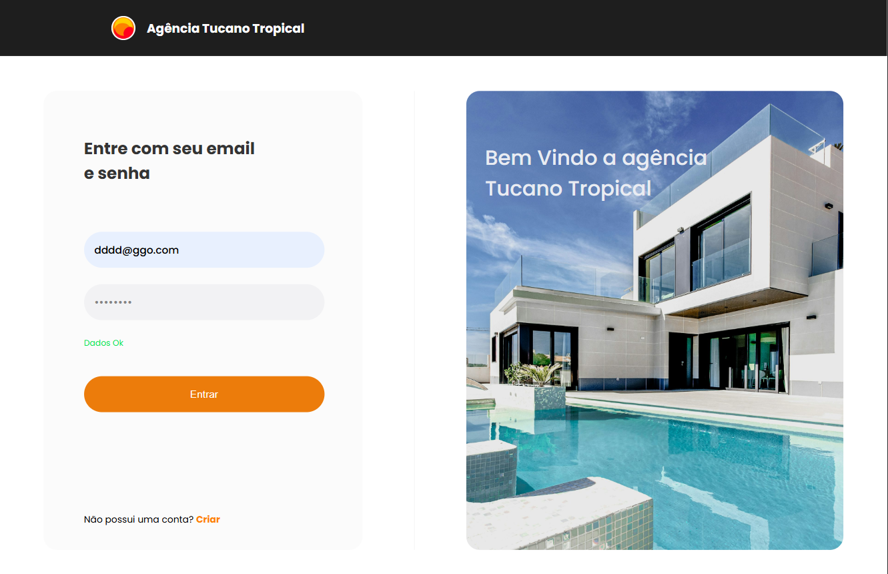
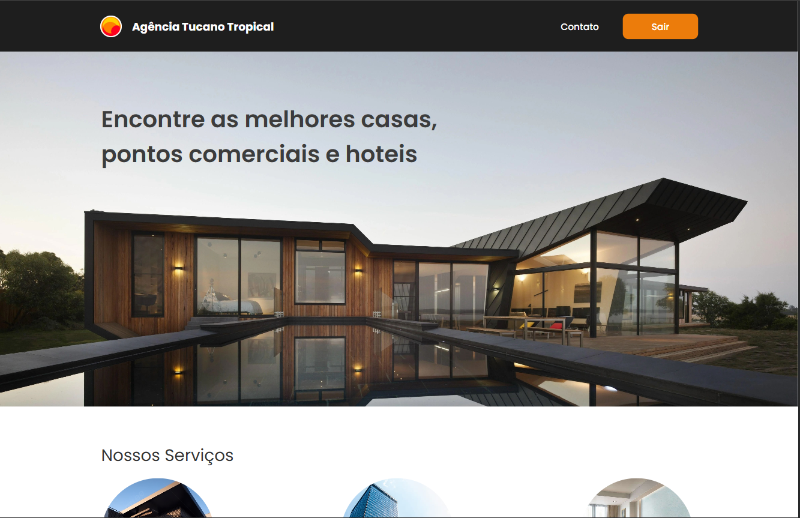
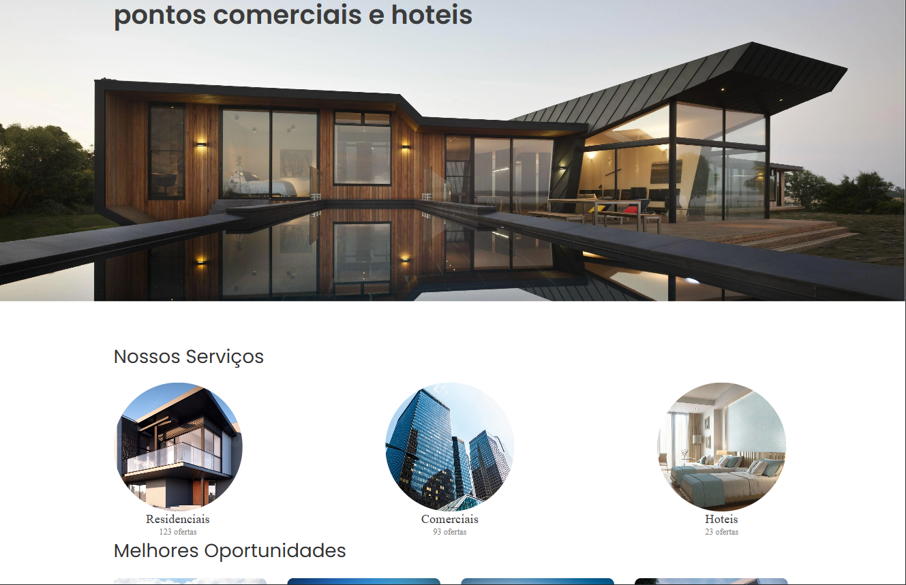
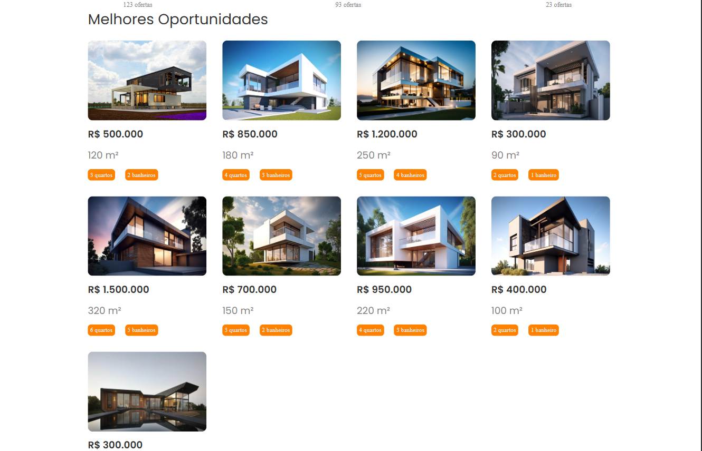
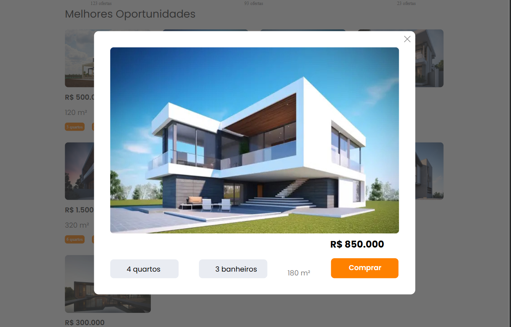
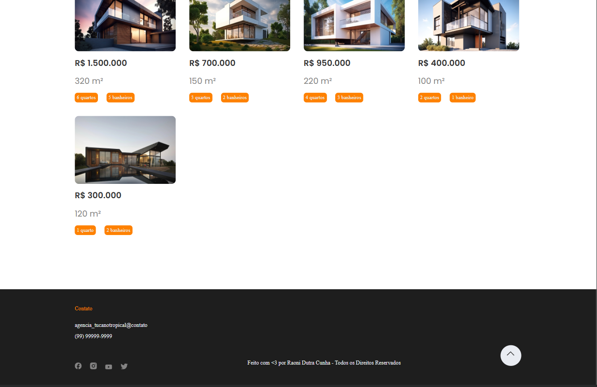
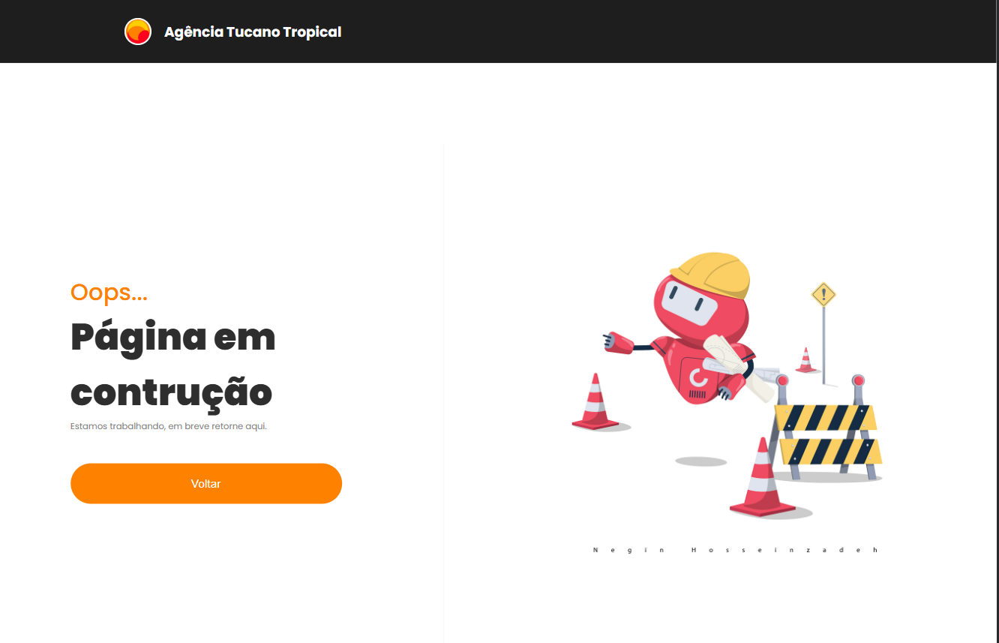
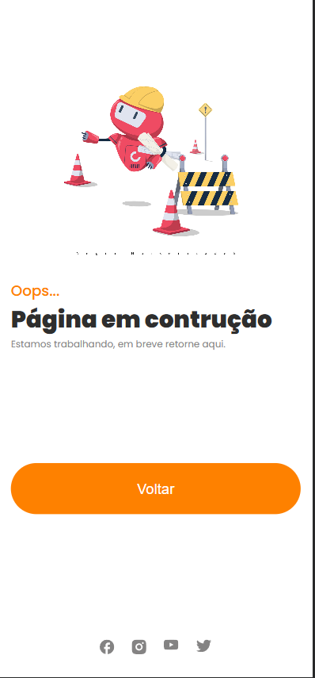
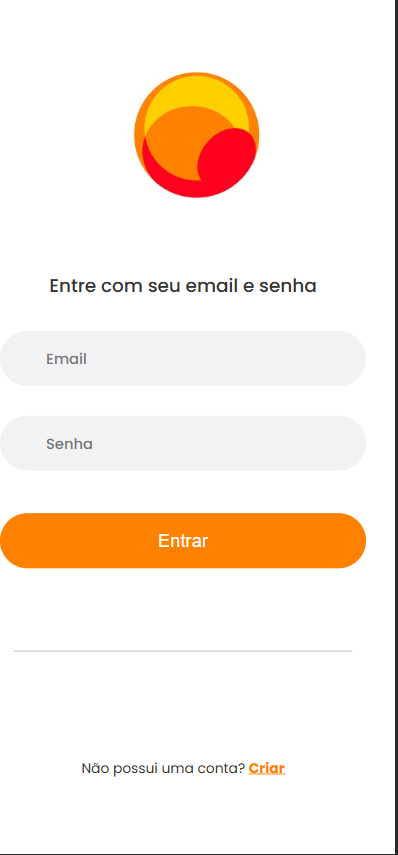

##Projeto de primeiro desafio da Compass.Uol##

A agência Tucano Tropical é uma agência imobiliaria que ajuda você a encontrar o seu paraiso perfeito para morar ou curtir as férias.

#Tela de Login:#

Na tela de Login é exibido um formulário de login com os seguintes campos:

- Email: Campo de entrada que aceita apenas o formato de e-mail. Caso o e-mail esteja em um formato inválido, é exibido uma mensagem de aviso.

  

- Senha: Deve conter no mínimo 8 caracteres. Caso a senha tenha menos de 8 caracteres, é exibido uma mensagem de aviso.

  

- Caso ambos os campos estejam vazios, também é exibido uma mensagem de aviso.

  

- O login só realizado quando todos os campos são validados e o login e senha conferem com o do nosso banco de dados.

  

#Tela Home/ou de Usuario Logado:#

  

- Seção "Nossos Serviços" - Nesta Seção é exibido todos os nossos serviços realizados

  

- Seção "Melhores Oportunidades": Nesta seção é exibidos as nosssas melhores oportunidades imobiliarias, alem disto quando clicadas é exibido um Modal com mais informações do Imovel.

  

- Modal: Exibe mais informações do Imóvel e também permite você comprar o item clicando no botão "Comprar" ( está página ainda está em construção).

  

- No rodapé da página também se encontra um botão que realizará o scroll para o inicio da página, se você achar necessario. 

  

#Telas de Erro:#

Caso alguma página ainda esteja em construção no nosso sistema ou esteja sendo modificada, é exibido uma tela de Erro lhe informando , neste caso , basta clicar no botão "Voltar" na tela e você poderá voltar a navegar normalmente nas demais páginas.

  

#Versões Mobile:# 

Alem disto, o nosso site contem acessibilidade para dispositivos móveis, se você estiver navegando em um dispositivo móvel ou tablet, notará que a página exibida será diferente da versão de navegador e será mais fácil o acesso.

  

  

#Tecnologias Utilizadas#:
    - HTML
    - CSS
    - JAVASCRIPT

